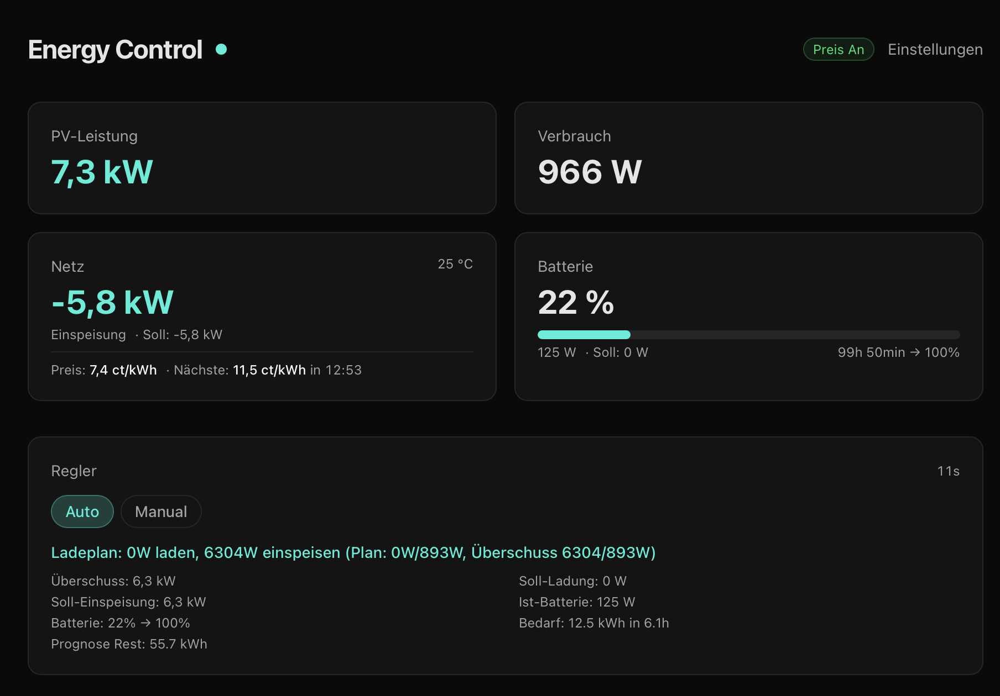
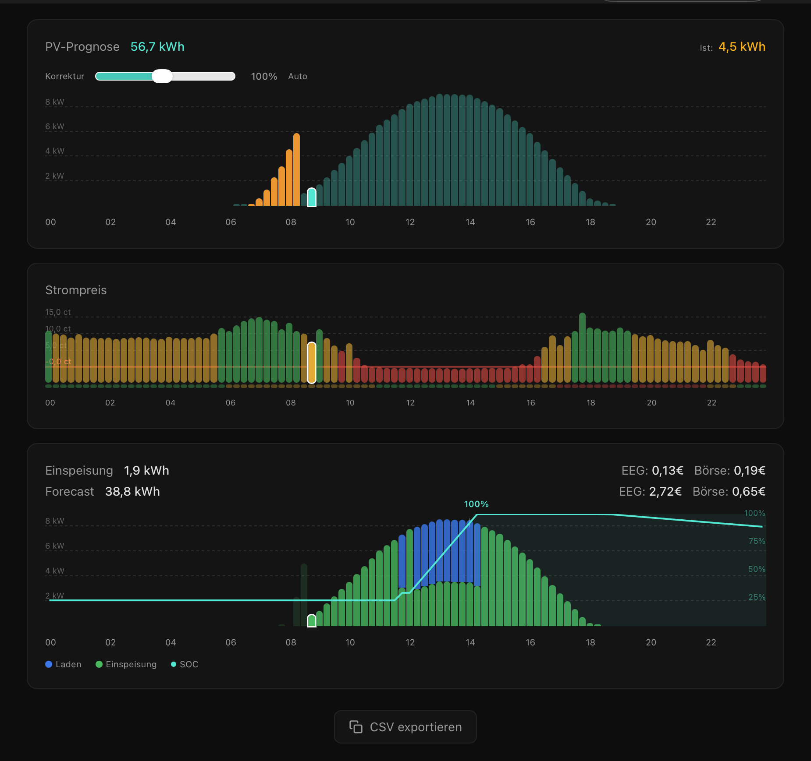

<p align="center">
  
</p>

<h1 align="center">Energy Control</h1>

<p align="center">
  Smart battery and solar management for Victron Energy systems.<br>
  Real-time grid regulation, price-optimized charging, and PV forecast ensemble.
</p>

<p align="center">
  
</p>

---

<p align="center">
  
</p>

<p align="center">
  
</p>

## What it does

Energy Control connects to a Victron system via MQTT and VRM, monitors solar production, battery state, and grid power in real time, and automatically adjusts the battery inverter setpoint to optimize self-consumption and feed-in revenue.

**Key features:**

- **Grid regulation** — closed-loop control that keeps grid exchange within a configurable deadband, reacting to surplus/deficit in real time
- **Price-optimized charging** — uses EPEX day-ahead spot prices to shift battery charging to the cheapest hours and feed-in to the most profitable ones
- **Charge planning** — generates hourly charge/feed-in schedules based on PV forecast, battery state, consumption profiles, and market prices
- **PV forecast ensemble** — combines VRM forecast and [forecast.solar](https://forecast.solar) with automatic correction factors for more accurate predictions
- **Smart meter integration** — optional Inexogy smart meter support for precise grid measurements
- **Live dashboard** — real-time web UI with power flows, charge plan visualization, price charts, and grid history

## Architecture

```
┌─────────────────────────────────────────────┐
│                  Docker Host                 │
│                                              │
│  ┌──────────────┐      ┌──────────────────┐  │
│  │   API :3002   │◄────►│   Web UI :3001   │  │
│  │   (Fastify)   │      │   (Next.js)      │  │
│  └──────┬───────┘      └──────────────────┘  │
│         │                                    │
│   MQTT ─┤─ VRM API ─ forecast.solar         │
│         │─ EPEX prices ─ Inexogy API        │
└─────────┼────────────────────────────────────┘
          │
    ┌─────▼─────┐
    │  Victron   │
    │  GX / MQTT │
    └───────────┘
```

**Monorepo structure:**

| Package | Description |
|---------|-------------|
| `packages/api` | Fastify backend — MQTT client, controller, VRM/forecast services, charge planner |
| `packages/web` | Next.js frontend — real-time dashboard and settings UI |
| `packages/shared` | Shared TypeScript types |

## Getting started

### Prerequisites

- Node.js 22+
- pnpm
- A Victron system with MQTT enabled (Cerbo GX / Venus OS)
- A VRM account with API token

### Setup

```bash
# Install dependencies
pnpm install

# Configure environment
cp .env.example .env
# Edit .env with your device IPs, VRM token, etc.

# Run in development mode
pnpm dev
```

The API starts on port **3002**, the web UI on port **3001**.

### Docker

```bash
# Build and deploy (see deploy.sh)
docker build -t energy-control .
docker run --network host --env-file .env energy-control
```

## Configuration

All configuration lives in `.env`. See [`.env.example`](.env.example) for the full list.

| Variable | Required | Description |
|----------|----------|-------------|
| `VICTRON_MQTT_URL` | yes | MQTT broker URL (e.g. `tcp://192.168.x.x:1883`) |
| `VICTRON_DEVICE_ID` | yes | Victron device portal ID |
| `VICTRON_VRM_TOKEN` | yes | VRM API bearer token |
| `VICTRON_VRM_SITE_ID` | yes | VRM installation ID |
| `INEXOGY_EMAIL` | no | Inexogy smart meter login |
| `INEXOGY_PASSWORD` | no | Inexogy smart meter password |
| `MPPT_TEMPERATURE_URL` | no | Shelly temperature sensor endpoint |
| `DEPLOY_SERVER` | no | SSH target for `deploy.sh` |

Runtime parameters (battery capacity, SoC limits, deadband, charge power, etc.) can be adjusted live through the settings UI or the REST API.

## Controller modes

| Mode | Behavior |
|------|----------|
| **Auto** | Closed-loop regulation based on forecast, prices, and battery state |
| **Manual** | Fixed grid setpoint — useful for testing or override |
| **Winter** | More aggressive charging with configurable threshold factor |

## API

The API exposes WebSocket for real-time updates and REST endpoints for configuration:

- `GET /status` — current system state, controller details, charge plan
- `GET /config` / `PUT /config` — runtime configuration
- `POST /controller/mode` — switch controller mode
- `GET /prices` — EPEX spot prices
- `GET /grid-history` — historical grid power data

## Tests

```bash
pnpm test
```

## Roadmap

Currently, Energy Control is built exclusively for **Victron Energy** systems. Future integrations are planned:

<table>
  <tr>
    <td align="center" width="50%">
      <br>
      <strong>EVCC</strong><br>
      <sub>EV charging integration — coordinate battery and wallbox to charge your car from excess solar at the best price.</sub>
    </td>
    <td align="center" width="50%">
      <br>
      <strong>Home Assistant</strong><br>
      <sub>Expose sensors, controls, and charge plans as HA entities for automation and multi-system dashboards.</sub>
    </td>
  </tr>
</table>

## License

Private project. All rights reserved.
